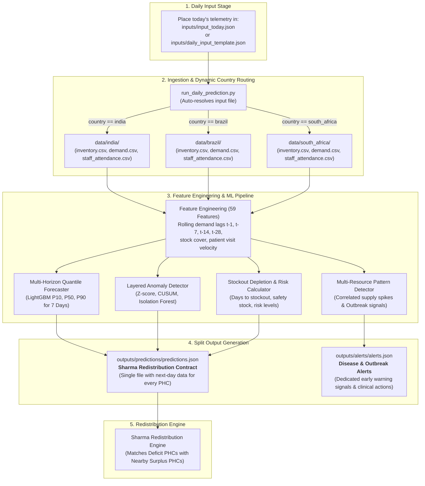

# BRICS Health Resilience ML System (`ai-ml`)

Production-ready machine learning framework for multi-horizon demand forecasting, anomaly & outbreak detection, stockout risk scoring, closed-loop simulation, and cross-country federated learning across India, Brazil, and South Africa.

---

## ⚡ Simple 3-Step Daily Flow (TL;DR)

> [!TIP]
> **This is all you need to do every day:**
>
> 1. **INPUT**: Put your daily file (`input_today.json`) into the **`inputs/`** folder.  
>    *(Use [`inputs/daily_input_template.json`](../inputs/daily_input_template.json) as your starting template)*.
>
> 2. **RUN**: Run in terminal:
>    ```bash
>    python ai-ml/run_daily_prediction.py
>    ```
>
> 3. **OUTPUT**: The ML model automatically processes the data and generates two files in **`outputs/`**:
>    * 📊 **`outputs/predictions/predictions.json`** ➔ Next-day predictions for **every PHC** (in the exact Sharma Redistribution format).
>    * 🚨 **`outputs/alerts/alerts.json`** ➔ Critical disease & outbreak early warning alerts (e.g. Dengue).

---

## 🔄 Daily Operational End-to-End Workflow



---

## Quick Start

### 1. Requirements & Dependencies
Make sure Python 3.10+ is installed along with required ML dependencies:

```bash
pip install torch lightgbm flwr pandas numpy scikit-learn pydantic jsonschema pytest
```

---

### 2. Daily Operational Telemetry Ingestion & Next-Day Prediction

1. **Enter today's operational data**:
   * Drop your JSON in `inputs/input_today.json` or edit [`inputs/daily_input_template.json`](../inputs/daily_input_template.json).
   * Specify `"country": "india"`, `"brazil"`, or `"south_africa"`.
   * Add facility inventory levels, patient visits, demand, and staff attendance.

2. **Execute the daily operational pipeline**:
   ```bash
   python ai-ml/run_daily_prediction.py
   ```
   *(The script automatically detects `input_today.json` or `daily_input_template.json` in `inputs/`)*.

3. **Outputs Generated**:
   * [**`outputs/predictions/predictions.json`**](../outputs/predictions/predictions.json): Complete next-day predictions for all PHCs matching the exact **Sharma Redistribution Contract** (ready for the Redistribution Engine).
   * [**`outputs/alerts/alerts.json`**](../outputs/alerts/alerts.json): Dedicated file containing all clinical outbreak early warning alerts.

---

### 3. Run the Full Master Pipeline Execution (12 Phases)
Run the end-to-end ML pipeline across all 12 system phases:

```bash
python ai-ml/main.py
```

This script automatically executes:
1. Data ingestion, validation & inventory reconciliation across India, Brazil, and South Africa.
2. Leak-free feature extraction (59 features spanning temporal, demand, inventory, operational, spatial, and cross-resource patterns).
3. Rolling-origin backtesting comparing Seasonal Naive, Moving Average, LightGBM Quantile, and DemandNet (GRU + Tabular).
4. Layered anomaly detection (Z-score, CUSUM, Isolation Forest) and multi-resource outbreak early warning alert generation.
5. Exact Sharma Redistribution JSON contract generation (`prediction_schema.json` compliant).
6. Multi-step closed-loop inventory redistribution simulation.
7. Federated Learning (FedProx) simulation across country nodes.

---

### 4. Run Automated Test Suite
Execute unit tests for all pipeline modules and the daily operational runner:

```bash
pytest ai-ml/tests
```

---

## Directory Structure

```
Bricks/
├── inputs/                         # Daily operational input JSON directory
│   ├── daily_input_template.json   # Template to enter next-day operational telemetry
│   └── input_today.json            # (Optional) Drop your daily telemetry here
├── outputs/                        # Standard ML model and operational outputs
│   ├── predictions/
│   │   └── predictions.json        # Single file: next-day Sharma Redistribution contract for all PHCs
│   └── alerts/
│       └── alerts.json             # Separate file: clinical disease & outbreak alerts
├── data/
│   ├── india/                      # India facility catalogs, telemetry CSVs & metadata
│   ├── brazil/                     # Brazil facility catalogs, telemetry CSVs & metadata
│   ├── south_africa/               # South Africa catalogs, telemetry CSVs & metadata
│   └── daily_telemetry_input.json  # 54-PHC full network simulated telemetry input
└── ai-ml/
    ├── run_daily_prediction.py     # Daily operational ingestion & prediction runner
    ├── main.py                     # Master 12-phase pipeline runner
    ├── README.md                   # System documentation (this file)
    ├── ML_EXPLANATION.md           # Deep-dive technical tutorial
    ├── config.yaml                 # System and model hyperparameters
    ├── schemas/                    # JSON schema definitions (prediction_schema.json)
    ├── preprocessing/              # Loaders, validators, stock reconciler, time splitters
    ├── features/                   # Feature extractors (temporal, demand, inventory, operational, spatial)
    ├── models/                     # Forecasters (LightGBM, DemandNet), AnomalyDetector, PatternDetector, RiskCalculator
    ├── training/                   # Evaluation metrics & rolling-origin backtester
    ├── inference/                  # Prediction service enforcing Sharma JSON contract
    ├── simulation/                 # Inventory state manager & closed-loop simulation harness
    ├── federated/                  # Flower FL client, FedProx strategy, and federation simulator
    └── tests/                      # Unit tests (including test_daily_pipeline.py)
```
